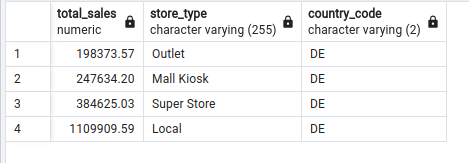

# Multinational Retail Data Centralisation

In this project I am tasked with extracting data from a multitude of sources and cleaning it before uploading it to a local postgres database. It demonstrates my use of python and various packages and modules to create utility classes for handling, cleaning, and extracting the data. These classes are designed to simplify common data handling tasks in a structured and modular way.

I learned a great deal working on this project, how to extract data from SQL tables, PDF files, API endpoints and S3 buckets. How to use VSCode to effectively clean and transform messy datasets into pandas dataframes...

## Contents

- Scenario
- Milestone 1 - Set up the environment
- Milestone 2 - Extract and clean the data from the data sources
- Milestone 3 - Creating the database schema
- Milestone 4 - Querying the data

## Scenario

You work for a multinational company that sells various goods across the globe. Currently, their sales data is spread across many different data sources making it not easily accessible or analysable by current members of the team. In an effort to become more data-driven, your organisation would like to make its sales data accessible from one centralised location. Your first goal will be to produce a system that stores the current company data in a database so that it's accessed from one centralised location and acts as a single source of truth for sales data. You will then query the database to get up-to-date metrics for the business.

## Milestone 1 - Set up the environment

First I setup Github to track changes to my code and save them in a Github repo. I also setup an environment for the project.

### Dependencies

    pandas: Data manipulation library for Python
    yaml: YAML parsing library for Python
    sqlalchemy: SQL toolkit and Object-Relational Mapping (ORM) for Python
    requests: HTTP library for Python
    boto3: Amazon Web Services (AWS) SDK for Python
    tabula: PDF table extraction library for Python

Install dependencies using:

```bash
pip install pandas yaml sqlalchemy requests boto3 tabula
```

## Milestone 2 - Extract and clean the data from the data sources

I set up a new database within pgadmin4 and named it `sales_data` which will store all the company information once processed.

Next I created the classes:

### DatabaseConnector

The `DatabaseConnector` class facilitates the connection to a PostgreSQL database. It reads database credentials from a YAML file, initializes the SQLAlchemy engine, and provides methods for listing database tables and uploading data to the new centralised database.

### DataExtractor

The `DataExtractor` class is designed to extract data from various sources. It can read data from a PostgreSQL table, retrieve data from a PDF file, retrieve data from multiple stores from a given endpoint, and extract data from an S3 bucket.

### DataCleaning

The `DataCleaning` class offers a suite of static methods for cleaning and transforming data in a pandas DataFrame. From removing null values to converting product weights, these methods cover a range of common data cleaning tasks.

### Data Sources

1. The first set of data is stored in the cloud in an AWS database and contains the historical data of users. The credentials for which are stored on a yaml file and can be accessed through the `DatabaseConnector` method, `read_db_creds(yaml_file_path)`.
The `init_db_engine(creds)` method takes in these credentials and initialises the SQLAlchemy engine. Then I was able to get a list of database tables from Amazons RDS using the `list_db_tables(engine)` method:


I require the data from the legacy_users table. To Extract this data for processing I used the DataExtractor method, `read_rds_table(table_name)`.
(Note: This class assumes the existence of the `DatabaseConnector` class)

```python
from data_extraction import DataExtractor

extractor = DataExtractor(db_connector)

users_df = extractor.read_rds_table(table_names[1])
```

Now I have a pandas DataFrame saved to the `users_df` variable. Each dataset has it's own static method within the `DataCleaning` class which I designed specifically for that set. To clean and normalise the `users_df` I passed it through the `clean_user_data()` method like so:

```python
from data_cleaning import DataCleaning

cleaned_users_df = DataCleaning.clean_user_data(users_df)
```

Each dataset has it's own cleaning method which has been customised to the needs of that dataset. The legacy users data was the most challenging to normalise and clean, in part due to it being one of the larger datasets, but also due to having many columns each containing multiple different formats and unusable data.

Once cleaned it can be uploaded to the new local database using the `DatabaseConnector` method `upload_to_db`, which takes in a dataframe and table name like so:

```python
db_connector.upload_to_db(cleaned_users_df, table_name='dim_users')
```

2. The next dataset, user card details are located in a PDF document in an AWS S3 bucket and can be extracted with the `retrieve_pdf_data` method from the DataExtractor class, which takes in a link as an argument and returns a pandas DataFrame.
It uses the tabula-py Python package, imported with tabula to extract all pages from the pdf document at a supplied link, then return a DataFrame of the extracted data. Similar to the above, it can then be cleaned and uploaded to the new centralised database:

```python
from database_utils import DatabaseConnector
from data_cleaning import DataCleaning
from data_extraction import DataExtractor

yaml_file_path = 'db_creds.yaml'

# Initialize the DatabaseConnector
db_connector = DatabaseConnector(yaml_file_path)

# Initialize the DataExtractor
extractor = DataExtractor(db_connector)

# Retrieve PDF data
card_details_df = DataExtractor.retrieve_pdf_data()

# Clean card details
cleaned_card_details_df = DataCleaning.clean_card_data(card_details_df)

# Upload to new centralised database
db_connector.upload_to_db(cleaned_card_details_df, table_name='dim_card_details')
```

3. The store data can be retrieved through the use of an API with the use of the `DataExtractor` methods `list_number_of_stores` which uses the `get` method to return the number of stores in the business, and `retrieve_stores_data` which uses the `get` method and a `for` loop to retrieve and concatenate the data from each store and return it as a pandas DataFrame.

```python
from database_utils import DatabaseConnector
from data_cleaning import DataCleaning
from data_extraction import DataExtractor

yaml_file_path = 'db_creds.yaml'

# Initialize the DatabaseConnector
db_connector = DatabaseConnector(yaml_file_path)

# Initialize the DataExtractor
extractor = DataExtractor(db_connector)

# Load credentials file
creds = db_connector.read_db_creds(yaml_file_path)

# The API key and value are stored in the `db_creds.yaml` file
header = {creds['KEY']: creds['VALUE']}

# Endpoints
retrieve_a_store_endpoint = 'https://aqj7u5id95.execute-api.eu-west-1.amazonaws.com/prod/store_details/'
return_number_stores_endpoint = 'https://aqj7u5id95.execute-api.eu-west-1.amazonaws.com/prod/number_stores'

# Retrieve the number of stores
number_of_stores = extractor.list_number_of_stores(return_number_stores_endpoint, header)

# Retrieve stores data
stores_df = extractor.retrieve_stores_data(number_of_stores, retrieve_a_store_endpoint, header)

# Clean stores data
cleaned_stores_df = DataCleaning.clean_store_data(stores_df)

# Upload to new centralised database
db_connector.upload_to_db(cleaned_stores_df, table_name='dim_store_details')
```

4. The data for all the products the company currently sells is located in an S3 bucket on AWS. This is extracted using the `DataExtractor` method `extract_form_s3` which uses the boto3 package to download and extract the information returning a pandas DataFrame (requires you to be logged into the AWS CLI).

```python
from data_cleaning import DataCleaning
from data_extraction import DataExtractor

# Initialize the DatabaseConnector
db_connector = DatabaseConnector(yaml_file_path)

# Initialize the DataExtractor
extractor = DataExtractor(db_connector)

s3_address = 's3://data-handling-public/products.csv'
product_data_df = extractor.extract_from_s3(s3_address)
```

Due to the product_weight column having different units such as `kg`, `g`, `ml`, `oz` and multipack values I developed a method `convert_products_weights` to convert the values to string before normalising the data to kilograms, removing unwanted characters and converting them to `float` data type. This is one of the more interesting methods that make up the `clean_products_data` method which will clean this dataset before uploading it to the new centralised database.

```python
# ... previous code
from data_cleaning import DataCleaning

cleaned_product_data_df = DataCleaning.clean_products_data(product_data_df)
db_connector.upload_to_db(cleaned_product_data_df, table_name='dim_products')
```

5. The orders table is one of the tables identified in example 1 and can be retieved in the same way:

```python
from database_utils import DatabaseConnector
from data_cleaning import DataCleaning
from data_extraction import DataExtractor

yaml_file_path = 'db_creds.yaml'

# Initialize the DatabaseConnector
db_connector = DatabaseConnector(yaml_file_path)

# Initialize the DataExtractor
extractor = DataExtractor(db_connector)

# Retrieve the orders table
orders_data_df = extractor.read_rds_table('orders_table')

# Clean the orders table
cleaned_orders_data_df = DataCleaning.clean_orders_data(orders_data_df)

# Upload to new centralised database
db_connector.upload_to_db(orders_data_df, table_name='orders_table')
```

6. The final source of data is a `JSON` file containing the details of when each sale happened. as well as related attributes. I extracted, cleaned and uploaded the data with the following:

```python
from database_utils import DatabaseConnector
from data_cleaning import DataCleaning
import pandas as pd

# Initialize the DatabaseConnector
db_connector = DatabaseConnector(yaml_file_path)

date_events_data_df = pd.read_json('https://data-handling-public.s3.eu-west-1.amazonaws.com/date_details.json')
    
cleaned_date_events_data_df = DataCleaning.clean_date_events_data(date_events_data_df)
db_connector.upload_to_db(cleaned_date_events_data_df, table_name='dim_date_times')
```

## Milestone 3 - Creating the database schema

Now the clean data is loaded into the database, the next step is to develop the star-based schema of the database, ensuring that the columns are of the correct data types. The date type, float type and boolean type columns were successfully inferred after the cleaning methods were appplied to the data. To correct the remaining data types I used the following syntax:

```sql
ALTER TABLE {table_name}
    ALTER COLUMN {column_name} TYPE {data type};
```

A typical example looked like this:

```sql
ALTER TABLE dim_products
    ALTER COLUMN product_code TYPE VARCHAR(11),
    ALTER COLUMN uuid TYPE uuid USING uuid::uuid,
    ALTER COLUMN "EAN" TYPE VARCHAR(13),
```

And where the datatype was altered to `VARCHAR(*)` the following query was adapted to establish the maximum length of the column data:


To assist the team that handles deliveries I added a new column `weight_class` to the `dim_products` table. The `weight_class` provides a human-readable column for the weight so they can quickly make decisions on delivery weights:

```sql
ALTER TABLE dim_products
    ADD weight_class VARCHAR(14);
UPDATE dim_products
    SET weight_class = 
        CASE 
            WHEN weight/1000 < 2 THEN 'Light'
            WHEN weight/1000 BETWEEN 2 AND 40 THEN 'Mid_Sized'
            WHEN weight/1000 BETWEEN 41 and 140 THEN 'Heavy'
            WHEN weight/1000 > 140 THEN 'Truck_Required'  
        ELSE 'Invalid' 
        END;
```

Now that the tables have the appropriate data types, the next step to develop the database schema is to add the primary keys to each of the `dim` tables where they match the same column in the `orders_table`:

```sql
ALTER TABLE dim_card_details
    ADD PRIMARY KEY (card_number);

ALTER TABLE dim_date_times
    ADD PRIMARY KEY (date_uuid);

ALTER TABLE dim_products
    ADD PRIMARY KEY (product_code);

ALTER TABLE dim_store_details
    ADD PRIMARY KEY (store_code);

ALTER TABLE dim_users
    ADD PRIMARY KEY (user_uuid);
```

Finally I added the foreign keys to `order_table`:

```
ALTER TABLE orders_table
    ADD FOREIGN KEY (card_number)
    REFERENCES dim_card_details(card_number);

ALTER TABLE orders_table
    ADD FOREIGN KEY (date_uuid)
    REFERENCES dim_date_times(date_uuid);

ALTER TABLE orders_table
    ADD FOREIGN KEY (product_code)
    REFERENCES dim_products(product_code);

ALTER TABLE orders_table
    ADD FOREIGN KEY (store_code)
    REFERENCES dim_store_details(store_code);

ALTER TABLE orders_table
    ADD FOREIGN KEY (user_uuid)
    REFERENCES dim_users(user_uuid);
```

## Milestone 4 - Querying the data

Now I have the schema for the database and all the sales data is in one location, the business would like some up-to-date metrics from the data. This section describes the business requests for specific data, the query I used to retrieve the data, and a screenshot of the top 5 results.

1. The Operations team would like to know which countries we currently operate in and which country now has the most stores.

```sql
SELECT 
    country_code AS country,
    COUNT(*) AS total_no_stores
FROM 
    dim_store_details
GROUP BY 
    country
ORDER BY 
    total_no_stores DESC;
```


2. The business stakeholders would like to know which locations currently have the most stores.

```sql
SELECT 
    locality,
    COUNT(*) AS total_no_stores
FROM 
    dim_store_details
GROUP BY 
    locality
ORDER BY 
    total_no_stores DESC;
```


3. Query the database to find out which months have produced the most sales.

```sql
SELECT
    ROUND(SUM(ot.product_quantity::NUMERIC * dp.product_price::NUMERIC), 2) AS total_sales,
    month
FROM 
    orders_table AS ot
JOIN
    dim_products AS dp
ON 
    ot.product_code = dp.product_code
JOIN 
    dim_date_times AS ddt
ON 
    ot.date_uuid = ddt.date_uuid
GROUP BY 
    month
ORDER BY 
    total_sales DESC;
```

I used `JOIN` to perform inner joins on the required tables going forward.
It was necessary to `CAST()` the data types (I used the postgres `::` operator) of the `bigint` and `float` columns to enable the `ROUND()` method to return the desired 2 decimal places.


4. The company is looking to increase its online sales. They want to know how many sales are happening online vs offline.
Calculate how many products were sold and the amount of sales made for online and offline purchases.

```sql
SELECT 
    COUNT(*) AS number_of_sales,
    SUM(product_quantity) AS product_quantity_count,
    CASE
        WHEN store_code LIKE 'WEB%' THEN 'Web'
        WHEN store_code NOT LIKE 'WEB%' THEN 'Offline'
    END AS location
FROM 
    orders_table
GROUP BY 
    location
ORDER BY 
    number_of_sales;
```


5. The sales team wants to know which of the different store types is generated the most revenue so they know where to focus.
Find out the total and percentage of sales coming from each of the different store types.

```sql
WITH StoreSales AS (
    SELECT 
        dsd.store_type,
        SUM(ot.product_quantity * dp.product_price) AS total_sales
    FROM 
        orders_table AS ot
    JOIN 
        dim_products AS dp 
    ON 
        ot.product_code = dp.product_code
    JOIN 
        dim_store_details AS dsd 
    ON 
        ot.store_code = dsd.store_code
    GROUP BY 
        dsd.store_type
)

SELECT 
    store_type,
    ROUND(total_sales::NUMERIC, 2) AS total_sales,
    ROUND((total_sales::NUMERIC / SUM(total_sales::NUMERIC) OVER ()) * 100, 2) AS percentage_total
FROM 
    StoreSales
ORDER BY 
    total_sales DESC;
```


6. The company stakeholders want assurances that the company has been doing well recently.
Find which months in which years have had the most sales historically.

```sql
SELECT
    ROUND(SUM(ot.product_quantity::NUMERIC * dp.product_price::NUMERIC), 2) AS total_sales,
    ddt.year,
    ddt.month
FROM 
    orders_table AS ot
JOIN 
    dim_products AS dp ON ot.product_code = dp.product_code
JOIN 
    dim_date_times AS ddt ON ot.date_uuid = ddt.date_uuid
GROUP BY
    ddt.year, ddt.month
ORDER BY 
    total_sales DESC
LIMIT 10;
```


7. The operations team would like to know the overall staff numbers in each location around the world. Perform a query to determine the staff numbers in each of the countries the company sells in.

```sql
SELECT
    SUM(staff_numbers) AS total_staff_numbers,
    country_code
FROM
    dim_store_details
GROUP BY
    country_code
ORDER BY
    total_staff_numbers DESC;
```


8. The sales team is looking to expand their territory in Germany. Determine which type of store is generating the most sales in Germany.

```sql
SELECT 
    ROUND(SUM(ot.product_quantity::NUMERIC * dp.product_price::NUMERIC), 2) AS total_sales,
    dsd.store_type,
    dsd.country_code
FROM 
    orders_table AS ot
JOIN 
    dim_products AS dp ON ot.product_code = dp.product_code
JOIN 
    dim_store_details AS dsd ON ot.store_code = dsd.store_code
WHERE 
    dsd.country_code = 'DE'
GROUP BY 
    dsd.store_type, dsd.country_code
ORDER BY 
    total_sales;
```



9. Sales would like the get an accurate metric for how quickly the company is making sales.
Determine the average time taken between each sale grouped by year.

I formed the SalesData CTE with the following steps:

- First I concatenated the year, month, day and timestamp columns with the pipe `|` operator in the innermost query.
- The middle query calculates the time difference between consecutive sales transactions using the `LEAD` window function, now referencing the concat_timestamp column.
- The outer query calculates the average time between sales transactions for each year by using the `AVG` function on the time differences. The result is grouped by year.

```sql
WITH SalesData AS (
    SELECT
        year,
        AVG(time_between_sales) AS avg_time_between_sales
    FROM (
        SELECT
            year,
            (LEAD(concat_timestamp) OVER (PARTITION BY year ORDER BY concat_timestamp) - concat_timestamp) AS time_between_sales
        FROM (
            SELECT
                year,
                (year || '-' || month || '-' || day || ' ' || timestamp)::timestamp AS concat_timestamp
            FROM
                dim_date_times
        ) AS timestamp_data 
    ) AS time_between_sales    
    GROUP BY
        year;
)
```

I then used the `CONCAT` function get the desired output format.

```
SELECT
    year,
    CONCAT('"hours": ',EXTRACT(hours FROM AVG(avg_time_between_sales)),' ',
     '"minutes": ', EXTRACT(minutes FROM AVG(avg_time_between_sales)), ' ',
     '"seconds": ', EXTRACT(seconds FROM AVG(avg_time_between_sales)), ' ',
     '"milliseconds": ', EXTRACT(milliseconds FROM AVG(avg_time_between_sales))
    ) AS actual_time_taken
FROM
    SalesData
GROUP BY
    year
ORDER BY
    AVG(avg_time_between_sales) DESC;
```


